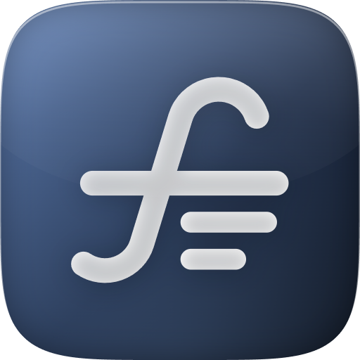

# Fintable



Connect [Fintable](https://fintable.io) to Grok Bot or Cursor to work with your
bank transactions, balances, investments, categories, and spreadsheet integrations.
This plugin connects to Fintable's hosted MCP server; no local server is required.

## Connect

1. Create or sign in to your [Fintable account](https://fintable.io).
2. Install this plugin through your client's plugin interface. In Grok Bot,
   connectors appear as plugins in Marketplace.
3. Choose **Connect** or **Authenticate** when prompted, sign in to Fintable,
   and review the consent screen. Approve only the Workspaces you want to share.
4. Ask your assistant to list your connected bank accounts.

Authentication uses your personal OAuth grant. The client discovers Fintable's
authorization server and manages sign-in and tokens. No API key, client secret,
environment variable, or credential belongs in this repository.

For manual MCP setup in Cursor, add this to your MCP configuration:

```json
{
  "mcpServers": {
    "fintable": {
      "url": "https://fintable.io/mcp"
    }
  }
}
```

## Things to try

- "List my connected bank accounts and their balances."
- "Summarize last month's spending by category."
- "Show my investment holdings."
- "Check when my bank connections last synced."
- "Show my categories and categorization rules."

The server also supports changing categories and rules, starting syncs,
managing connections, and managing eligible Workspaces. Its tools and usage
instructions are supplied by the server when the client connects.

## Access and data

The `mcp:use` permission grants **read and write access** to your authorized
Fintable data, including destructive actions such as deleting connections and
categories. Review proposed changes before approving them in your assistant.
Connecting the plugin alone does not start a bank sync or change your data.

Use this connector only for financial accounts you own or are authorized to
manage. Access to additional Workspaces requires an explicit grant; without a
Workspace selection, tools use your default Workspace. Disabled accounts are
excluded by default.

API and MCP access are available on all Fintable plans, including the free plan.
Bank connections, sync frequency, Workspace features, and other service limits
depend on your plan. Your assistant's own subscription requirements also apply.

Revoke the OAuth connection in
[Fintable → Security → Connected Apps](https://fintable.io/dash/v2/security)
when you no longer want the assistant to have access.

## Help

- [Fintable AI setup and MCP tools](https://fintable.io/ai)
- [API documentation](https://fintable.io/docs)
- [Privacy policy](https://fintable.io/privacy-policy)
- [Terms of service](https://fintable.io/terms-of-service)
- [Contact support](mailto:support@fintable.io)

This package follows the [Agent Plugins standard](https://agent-plugins.org/).
It contains the plugin manifest, remote MCP configuration, and Fintable artwork.
